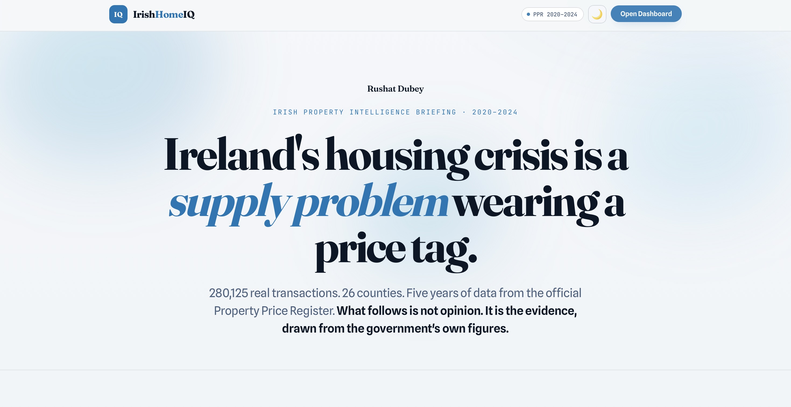

# IrishHomeIQ

### Irish Property Market Intelligence Platform

**280,125 real transactions · 26 counties · 2020 to 2024**

[Live Demo](https://irishhomeiq.vercel.app) · [GitHub](https://github.com/rushatdubey/irishhomeiq) · [LinkedIn](https://linkedin.com/in/rushat)

---

IrishHomeIQ is a property intelligence platform built on real Irish government data. It transforms 280,125 transactions from the official Property Price Register into a structured analytics system covering affordability deterioration, market momentum, supply shortages, Dublin postcode segmentation, mortgage stress, and county-level investment signals.

The platform is built as a fully custom web product with an editorial-magazine landing experience, a sea-blue neumorphic design system, Fraunces serif typography, and an interactive five-tab analytics dashboard, designed to the standard of commercial proptech intelligence tools.

---

## Live Demo

https://irishhomeiq.vercel.app

To run locally, clone the repo and open `index.html` in any modern browser. No build step, no dependencies, no server required.

```bash
git clone https://github.com/rushatdubey/irishhomeiq
cd irishhomeiq
open index.html
```

---

## Platform Preview

### Landing Page


---


## The Business Problem

Ireland's property market produces more transaction data than almost any other sector. Most public analysis stops at county-level annual averages. That is not enough for the decisions that actually matter.

IrishHomeIQ answers the questions that banks, mortgage lenders, and property funds need answered:

- Which markets are accelerating right now, not last year, but this quarter?
- Where can a first-time buyer actually afford to purchase at current LTI and LTV limits?
- Is the new-build pipeline keeping pace with demand, or are developers abandoning supply exactly where it is needed most?
- What does Dublin pricing look like at postcode level? D06W and D24 are in the same county but separated by €555,000.
- When is the structurally optimal window to buy or sell based on five years of seasonal data?

---

## Key Findings

| Signal | Detail |
|---|---|
| Monaghan and Cavan leading momentum | 3-month price momentum above 23%, highest acceleration in Ireland right now |
| Dublin D06W median €825,000 | vs D24 at €270,000, a €555K spread within a single county |
| FTB cannot afford Dublin at LTI 4x | Affordability gap of 46.7%, max mortgage covers only 53% of Dublin median |
| New builds command 83% premium in Leitrim | Only 9% in Dublin, a structural signal of where supply is genuinely scarce |
| October to December is the optimal sell window | Price index peaks at 104, volume 44% above annual average, consistent across all five years |
| January to May is the optimal buy window | Prices run 3 to 4% below annual average, lowest buyer competition |
| Dublin heat index 69.6, highest in Ireland | Composite of price level, YoY growth rate, and transaction volume |
| National supply deficit 47,000+ units | No county delivered more than 73% of estimated annual demand in 2024 |

---

## Platform Modules

### Market Momentum
Annual and monthly price trends across all 26 counties. Rolling 3-month and 6-month momentum signals to identify which markets are accelerating versus plateauing. Transaction velocity used as a leading indicator of future price movement. YoY growth rates, Dublin vs Rest of Ireland divergence, and regional trajectories across Leinster, Munster, Connacht, and Ulster.

### Dublin Postcode Intelligence
Sub-county segmentation from D01 to D24. Median prices, growth rates, and volume for each postcode district. New-build vs second-hand premium analysis by postcode zone. Inner City, Mid City, and Outer City pricing tiers. The D06W to D24 spread of €555,000 within a single county makes this level of granularity essential.

### Affordability Stress
Price-to-income ratios and years-of-salary-to-buy for all 26 counties across all five years. Mortgage stress modelling at Irish macro-prudential limits: LTI 4x, LTV 90%, stress rate 6%. First-time buyer affordability gap analysis. Deterioration tracking from 2020 to 2024 county by county. Dublin now requires 10.2 years of gross annual salary.

### Supply and Demand Analytics
New completions vs estimated demand by county and year. Cumulative housing deficit since 2020. Supply ratio classification from Critical Shortage to Near Balance. Leinster commuter belt deep-dive covering Kildare, Meath, Wicklow, Louth, and Westmeath as structural Dublin overspill markets.

### Investment Signals
Composite scoring model built on four components: price growth (30%), supply pressure (30%), rental yield (25%), and affordability (15%). Risk-adjusted return ranking. Undervalued market flags for counties with below-median pricing combined with strong momentum and tight supply. Tier 1 through Tier 3 county classification.

---

## Data Architecture

All data is sourced from official, publicly available Irish government datasets.

| Source | Dataset | Coverage |
|---|---|---|
| PSRA Property Price Register | All residential transactions | 2020 to 2024, 26 counties |
| CSO Ireland | Average annual wages by county | Used for affordability modelling |
| Department of Housing | New completions and planning data | County-level supply tracking |

The Python pipeline processes raw PPR CSV files through 12 analytical stages, outputting structured datasets used directly by the frontend analytics layer.

---

## SQL Intelligence Layer

The SQL layer handles complex analytical queries across four files targeting different dimensions of the market.

**Price momentum with rolling windows**

```sql
WITH monthly AS (
    SELECT county, DATE_TRUNC('month', date_of_sale) AS month,
        PERCENTILE_CONT(0.5) WITHIN GROUP (ORDER BY price_eur) AS median_price
    FROM transactions
    GROUP BY county, month
)
SELECT county, month, median_price,
    ROUND(AVG(median_price) OVER (
        PARTITION BY county ORDER BY month
        ROWS BETWEEN 5 PRECEDING AND CURRENT ROW
    ), 0) AS rolling_6m_avg,
    ROUND((median_price / LAG(median_price, 3) OVER (
        PARTITION BY county ORDER BY month
    ) - 1) * 100, 1) AS momentum_3m_pct
FROM monthly
ORDER BY county, month;
```

**First-time buyer mortgage affordability gap**

```sql
SELECT county, year,
    median_price,
    avg_annual_wage * 4                         AS max_mortgage_lti,
    avg_annual_wage * 4 / 0.90                  AS max_affordable_price,
    median_price - (avg_annual_wage * 4 / 0.90) AS affordability_gap_eur,
    ROUND((median_price - avg_annual_wage * 4 / 0.90)
          / median_price * 100, 1)              AS gap_pct
FROM affordability
WHERE year = 2024
ORDER BY gap_pct DESC;
```

**New-build premium by county**

```sql
SELECT county, year,
    ROUND((MAX(CASE WHEN vat_exclusive = 'Yes' THEN price_eur END) -
           MAX(CASE WHEN vat_exclusive = 'No'  THEN price_eur END))
          / NULLIF(MAX(CASE WHEN vat_exclusive = 'No' THEN price_eur END), 0)
          * 100, 1) AS new_build_premium_pct
FROM (
    SELECT county, year, vat_exclusive,
        PERCENTILE_CONT(0.5) WITHIN GROUP (ORDER BY price_eur) AS price_eur
    FROM transactions
    GROUP BY county, year, vat_exclusive
) t
GROUP BY county, year
ORDER BY new_build_premium_pct DESC;
```

**SQL techniques used:** window functions, `PERCENTILE_CONT`, `LAG`, rolling aggregates, CTEs, conditional aggregation, cumulative sums, `RANK() OVER`, `FIRST_VALUE`, sub-county segmentation.

---

## Python Analytics Pipeline

12-stage modular pipeline built with Pandas and NumPy. Processes raw PPR data through cleaning, enrichment, and analytical computation to produce structured JSON and CSV outputs consumed by the frontend.

| Stage | Output | Answers |
|---|---|---|
| 1 | market_pulse | Annual median price, YoY growth, total transaction value by county |
| 2 | monthly_momentum | Rolling 3m and 6m price momentum, which markets are accelerating |
| 3 | transaction_velocity | Volume trends as a leading indicator of future price direction |
| 4 | property_type | New build vs second-hand price trajectories and premiums |
| 5 | dublin_postcodes | D01 to D24 postcode-level median prices and growth rates |
| 6 | mortgage_stress | FTB affordability gap at LTI 4x and LTV 90% macro-prudential limits |
| 7 | market_heat_index | Composite heat score combining price, growth, and transaction volume |
| 8 | seasonality | When to buy and sell based on consistent seasonal patterns |
| 9 | affordability | Years-of-salary analysis, deterioration since 2020, severity classification |
| 10 | supply_demand | Completions vs demand, cumulative deficit by county |
| 11 | investment_scores | 4-component composite score, risk-adjusted return, undervalued flags |
| 12 | national_summary | Executive summary, national medians, market direction indicators |

---

## Tech Stack

| Layer | Technology |
|---|---|
| Data Processing | Python, Pandas, NumPy |
| Analytics and Modelling | SQL (PostgreSQL-compatible), Python |
| Frontend | HTML5, CSS3 (sea-blue neumorphic design system), Vanilla JavaScript |
| Typography | Fraunces (serif), Spline Sans (body), JetBrains Mono (labels) |
| Charts and Visualisation | Chart.js |
| UI Architecture | CSS variables, neumorphic shadows, editorial narrative layout, light/dark mode |
| Data Sources | PSRA Property Price Register, CSO Ireland, Department of Housing |

---

## Business Insights

**The affordability collapse is structural, not cyclical.** Dublin now requires 10.2 years of gross salary to purchase a median property. At Irish LTI 4x and LTV 90% limits, a first-time buyer's maximum affordable price is €266,000 against a median of €495,000. The 46.7% gap cannot be closed by income growth alone at current price trajectory.

**Supply constraint is the mechanism, not the symptom.** No Irish county delivered more than 73% of its estimated annual housing demand in 2024. Dublin's completions cover only 48% of demand. The 47,000-unit national deficit represents five years of structural underbuilding that will sustain price pressure regardless of demand-side intervention.

**The commuter belt is a Dublin proxy market, not a value escape.** Kildare, Meath, and Wicklow have median prices between €341,000 and €374,000 with supply ratios between 0.55 and 0.62. They offer marginally better affordability but carry the same supply pressure dynamics as the capital.

**The real investment signal is in the midlands and northwest.** Leitrim, Roscommon, Longford, Cavan, and Monaghan show four-year price growth between 35% and 44% from a low base. New-build premiums of 60 to 83% signal genuine local supply scarcity. Composite investment scores of 65 to 78 place them in Tier 1.

**Timing the market is possible with five years of consistent seasonal data.** The October to December window produces a price index of 103 to 104 with transaction volume 44% above annual average. The January to May window produces a price index of 96 to 98. The pattern is consistent across all five years in the dataset.

---

## Design Philosophy

The platform UI was built to the standard of a commercial intelligence briefing, not an academic dashboard. The landing page reads as an editorial argument: a thesis, five numbered chapters of evidence, a pull quote, and an executive takeaway, before the reader ever reaches the interactive dashboard.

Visual references: Bloomberg property analytics, editorial financial briefings, modern proptech platforms, investment intelligence terminals.

**Editorial typography system.** Fraunces, a high-contrast serif, carries every headline and metric figure. Spline Sans handles body text. JetBrains Mono labels every kicker, axis, and data tag. The result reads like a printed market briefing rather than a generic SaaS dashboard.

**Sea-blue neumorphic system** built entirely in CSS using a custom token architecture. The `#0077b6` sea-blue accent runs through headlines, charts, pills, and interactive states. Shadows, depth, and surface contrast replace traditional borders and flat fills, with distinct resting, hover, and active states built from the same shadow system.

**Editorial landing narrative.** A byline opens into a macro thesis, then five chapters that each pair a headline, supporting chart, and neumorphic metric pills: the affordability collapse, the supply deficit, the capital premium, the investment signal, and the timing signal. Drifting sea-blue blur blobs animate behind the hero. Staggered fade-up entrance animations carry the reader down the page.

**Five-tab analytics dashboard** reached through a smooth expand transition from the landing page. Market Pulse, Dublin Intel, Affordability, Supply Gap, and Investment, each with KPI cards, Chart.js visualisations, insight callouts, and semantic colour thresholds. Lazy chart initialisation and canvas resize on tab switch keep rendering crisp.

**Full light and dark mode** with live chart recolouring. The sea-blue accent stays vivid in dark mode while the warm-charcoal background keeps charts and data readable at every contrast level.

**Fully responsive** from desktop to mobile with adaptive grid layouts, readable charts at every breakpoint, and a collapsing layout for smaller screens.

---

## Repository Structure

```
irishhomeiq/
├── index.html                    # Platform entry point, landing page and dashboard
├──preview/              # Platform preview image 
├── sql/
│   ├── 01_schema.sql             # PostgreSQL schema and indexes
│   ├── 02_market_analysis.sql    # Price trends, YoY growth, Dublin vs ROI
│   ├── 03_affordability_supply.sql  # Affordability crisis, supply gap analysis
│   └── 04_investment_scoring.sql    # Composite scoring, undervalued market flags
├── python/
│   ├── analytics_v2.py           # 12-stage analytics pipeline
│   ├── load_real_data.py         # PPR CSV loader and cleaner
│   └── generate_data.py          # Synthetic data generator for testing
├── README.md
└── LICENSE
```

---

## Skills Demonstrated

**SQL:** Window functions, `PERCENTILE_CONT`, `LAG`, rolling aggregates with `ROWS BETWEEN`, CTEs, conditional aggregation, `RANK() OVER`, `FIRST_VALUE`, sub-county granularity, cross-table joins.

**Python:** 12-stage modular pipeline, rolling momentum calculation, lognormal price distribution modelling, mortgage stress testing at regulatory limits, composite investment scoring, seasonal decomposition, cumulative deficit tracking.

**Frontend Engineering:** Custom CSS design system using variables and neumorphic shadow tokens, editorial-magazine landing layout (thesis, chapters, pull quote, takeaway), Fraunces and JetBrains Mono typography pairing, vanilla JavaScript for SPA-style page transitions, Chart.js with dynamic canvas resize and live dark-mode recolouring, responsive grid layouts, staggered CSS animations with drifting blob backgrounds.

**Business Analytics:** FTB affordability modelling at Irish macro-prudential limits, price momentum signals, new-build supply intelligence, market heat scoring, postcode-level segmentation, risk-adjusted return ranking, undervalued market identification.

**Data Engineering:** Multi-year CSV merging, encoding normalisation (Latin-1, UTF-8, CP1252), price string cleaning for real-world PPR formats, county name standardisation, outlier filtering, derived column generation.

---

## About the Project

Ireland's housing data is public and detailed. Most analysis of it is neither. County-level annual averages obscure the postcode-level reality in Dublin, the structural divergence between the capital and the rest of the country, and the momentum signals that show which markets are moving before the headline statistics catch up.

IrishHomeIQ was built to close that gap. Takes the same raw data available to anyone and structure it into the kind of intelligence that would cost money from a commercial provider. The platform covers affordability, supply, momentum, seasonality, mortgage stress, and investment opportunity across the full dataset, presented through a product-grade interface built to the standard of the tools used in commercial property analytics.

---

## Data Availability

The full raw datasets used in this project are intentionally omitted from the public repository due to file size limitations and source aggregation constraints.

IrishHomeIQ combines:

- Irish Property Price Register (PPR) transactions
- CSO wage and earnings datasets
- Housing completion statistics
- Mortgage affordability calculations
- County-level supply and demand indicators

The repository includes:

- SQL transformation logic
- Python data generation and processing scripts
- Dashboard implementation
- Derived analytical models and scoring frameworks

All dashboard metrics, visualisations, and analytical outputs shown in the project are generated from these underlying datasets.

---

## Author

**Rushat Dubey**
Dublin, Ireland

[linkedin.com/in/rushat](https://linkedin.com/in/rushat) · [rushatdubey16@gmail.com](mailto:rushatdubey16@gmail.com) · [github.com/rushatdubey](https://github.com/rushatdubey)
